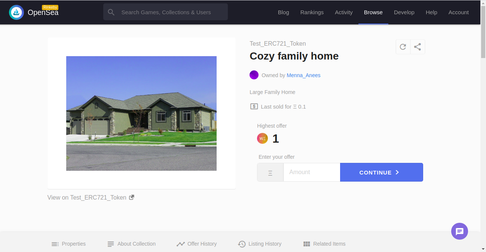

# Blockchain Real Estate Marketplace Dapp 
 A decentralized house listing service.

---
## Steps to deploy on Ganache and test contracts:
1. clone repo & cd the repo folder
2. install modules:  ```npm i ```
3. cd the ethereum contracts folder: ```cd eth-contracts/ ```
4. compile contracts: ``` truffle compile```
5. in second terminal run ganache: ```ganache-cli```
6. in the first terminal to run all tests:  ``` truffle test```

--- 
## Steps to deploy on rinkeby:
1. create a project and get your projectId from Infura: https://infura.io

2. setup rinkeby configurations in truffle-config:
    - require HDWalletProvider
    - set your mnemonic metamask seed
    - set your infuraKey
3. migrate to rinkeby network: ```truffle migrate --network rinkeby```

4. finding your token on etherscan: https://rinkeby.etherscan.io/token/<contract_address>
https://rinkeby.etherscan.io/token/0x9D8A4dEf5eFdF0589E1B7cFD9969C772322C035E


5. mint 10 tokens using MEW: https://www.myetherwallet.com/

6. openSea marketPlace storefront link: https://rinkeby.opensea.io/assets/test-erc721-token


7. view token on opensea: https://rinkeby.opensea.io/assets/<contract_address>/<token_id>
https://rinkeby.opensea.io/assets/0x9D8A4dEf5eFdF0589E1B7cFD9969C772322C035E/1



8. view 5 purchased tokens:
https://rinkeby.opensea.io/assets/0x9D8A4dEf5eFdF0589E1B7cFD9969C772322C035E/1
https://rinkeby.opensea.io/assets/0x9D8A4dEf5eFdF0589E1B7cFD9969C772322C035E/2
https://rinkeby.opensea.io/assets/0x9D8A4dEf5eFdF0589E1B7cFD9969C772322C035E/3
https://rinkeby.opensea.io/assets/0x9D8A4dEf5eFdF0589E1B7cFD9969C772322C035E/4
https://rinkeby.opensea.io/assets/0x9D8A4dEf5eFdF0589E1B7cFD9969C772322C035E/5


9. view other 5 non purchased tokens:
https://rinkeby.opensea.io/assets/0x9D8A4dEf5eFdF0589E1B7cFD9969C772322C035E/6
https://rinkeby.opensea.io/assets/0x9D8A4dEf5eFdF0589E1B7cFD9969C772322C035E/7
https://rinkeby.opensea.io/assets/0x9D8A4dEf5eFdF0589E1B7cFD9969C772322C035E/8
https://rinkeby.opensea.io/assets/0x9D8A4dEf5eFdF0589E1B7cFD9969C772322C035E/9
https://rinkeby.opensea.io/assets/0x9D8A4dEf5eFdF0589E1B7cFD9969C772322C035E/10